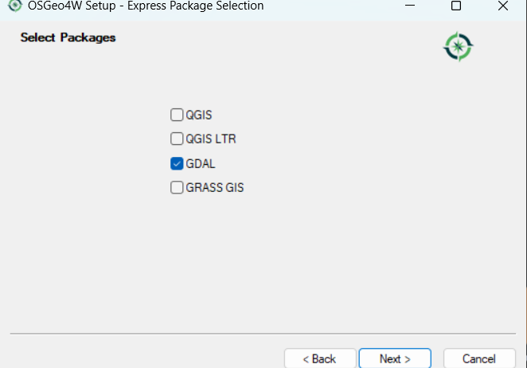
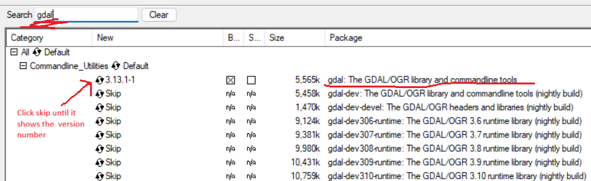
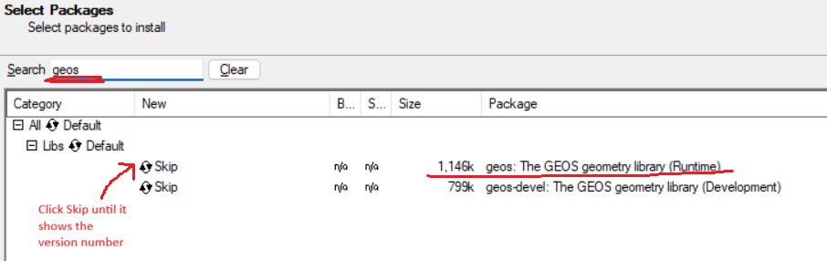
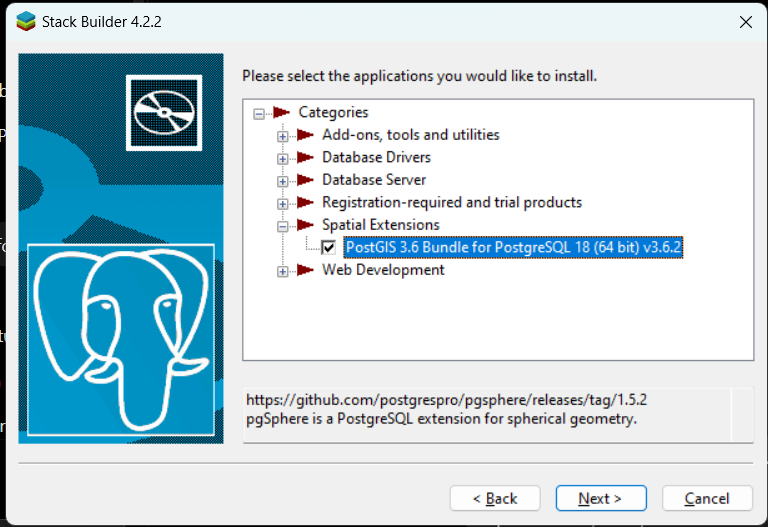

# SugboGo Backend

The SugboGo backend is built with **Django** and **Django REST Framework**. It provides the REST API for the web and mobile applications, including authentication, user management, merchant operations, and administrative features.

## Tech Stack

- Python
- Django
- Django REST Framework
- PostgreSQL
- JWT Authentication

## Backend Folder Strucutre

sugbogo_backend/
│
├── apps/                         # Main Django applications
│   │
│   ├── authentication/           # Login, registration, OAuth, JWT, email verification, password reset
│   │   ├── services/             # Business logic services (email, login, OAuth, tokens)
│   │   ├── views/                # Authentication API endpoints
│   │   ├── tests/                # Authentication test cases
│   │   └── templates/            # Email templates
│   │
│   ├── users/                    # Custom user model, profiles, user-related APIs
│   │
│   ├── msme/                     # MSME/location/category/tag management
│   │
│   ├── merchant_operations/      # Merchant-specific features
│   │
│   ├── admin_operations/         # Admin panel features
│   │   ├── dashboard/            # Admin dashboard APIs
│   │   ├── user_management/      # Admin user management
│   │   ├── msme_management/      # Admin MSME management
│   │   ├── activity_management/  # Admin activity monitoring
│   │   └── system_configuration/ # System settings management
│   │
│   ├── core/                     # Shared backend utilities (responses, exceptions, helpers)
│   │
│   └── shared/                   # Shared services used across applications
│       └── services/             # External service integrations
│
├── config/                       # Django project configuration
│   ├── settings.py               # Django settings
│   ├── urls.py                   # Root URL routing
│   ├── asgi.py                   # ASGI configuration
│   └── wsgi.py                   # WSGI configuration
│
├── docs/                         # Documentation files and setup images
│   └── images/                   # README screenshots
│
├── manage.py                     # Django command-line utility
├── requirements.txt              # Python dependencies
├── .env                          # Local environment variables
├── .env.example                  # Environment variable template
└── README.md                     # Backend setup documentation

## Requirements

Install the following before setting up the project:

- Python 3.11 or later
- PostgreSQL
- Git

## 1). Clone the Repository

```bash
git clone <repository-url>
cd SugboGo/sugbogo_backend
```

## 2.) Create a Virtual Environment

```bash
python -m venv .venv
```

Activate the virtual environment.

**Windows (PowerShell)**

```powershell
.venv\Scripts\Activate
```

**macOS / Linux**

```bash
source .venv/bin/activate
```

## 3.) Install Dependencies

Upgrade pip (recommended):

```bash
python -m pip install --upgrade pip
```

Install the project dependencies:

```bash
pip install -r requirements.txt
```

## 4.) Configure Environment Variables

Copy the example environment file.

**Windows (PowerShell)**

```powershell
Copy-Item .env.example .env
```

**macOS / Linux**

```bash
cp .env.example .env
```

Update the values in `.env` before running the application.

---
### 4.1.) Generate a Django Secret Key

Generate a new secret key:

```bash
python -c "from django.core.management.utils import get_random_secret_key; print(get_random_secret_key())"
```

Copy the generated key into your `.env` file.

```env
SECRET_KEY=your-generated-secret-key
```

### 4.2.) Install GIS Dependencies (Windows)

SugboGo uses **GeoDjango** for location services.

1. Download and run **`osgeo4w-setup.exe`** from the OSGeo4W website.
2. Install to:

```text
C:\OSGeo4W
```

#### Option 1: Express Install (Recommended)

Choose **Express Install**, then search for and install:

- `gdal`

The installer will automatically install the required `geos` dependency.



---

#### Option 2: Advanced Install

Choose **Advanced Install**.

Search for each package below and click **Skip** until it changes to a version number.

- `gdal`
- `geos`

> Do **not** install `gdal-dev` or `geos-devel`.

#### GDAL



#### GEOS



> Complete the installation.


#### Configure GIS Environment Variables

Update the following variables in your `.env` file to match your OSGeo4W installation:

```env
GDAL_LIBRARY_PATH=C:\path\to\OSGeo4W\bin\gdal313.dll
GEOS_LIBRARY_PATH=C:\path\to\OSGeo4W\bin\geos_c.dll
```

> **Note**
>
> If your installed GDAL version differs (for example, `gdal314.dll` instead of `gdal313.dll`), update `GDAL_LIBRARY_PATH` to match the installed DLL.


### 4.3.) Install PostGIS Extension (Windows)

SugboGo uses **PostGIS** for storing and querying geographic data. PostGIS extends PostgreSQL with support for geospatial data types and queries.

If you installed PostgreSQL using the official PostgreSQL installer, use **Application Stack Builder** to install PostGIS.

### 4.4) Open Application Stack Builder

1. Open **pgAdmin**.
2. From the PostgreSQL installation folder, open **Application Stack Builder** (or search for **Stack Builder** in the Windows Start Menu).
3. Select your PostgreSQL server from the drop-down menu and click **Next**.
4. Expand **Spatial Extensions** and select the **PostGIS** package.




---
## 5.) Create PostgreSQL Database

Create a database named:

```text
sugbogo_db
```
#### 5.1) Enable PostGIS Extension

After installing PostGIS through **Application Stack Builder**, enable the extension for your `sugbogo` database using either **pgAdmin** or **DBeaver**:

##### Option A: Using pgAdmin
Navigate to:  
`pgAdmin` → `Databases` → `sugbogo` → `Query Tool`

##### Option B: Using DBeaver
Navigate to:  
`DBeaver` → `PostgreSQL Connection` → `sugbogo` → `SQL Editor`

---

Once your SQL Query Tool or Editor is open:

- Run the following command to enable PostGIS:

```sql
CREATE EXTENSION IF NOT EXISTS postgis;
```
---
#### 5.3) Configure Database Environment Variables

Update the following variables in your `sugbogo_backend/.env`

```env
DB_NAME=sugbogo_db
DB_USER=postgres
DB_PASSWORD=your-password
DB_HOST=localhost
DB_PORT=5432
```


---


## 6.) Configure External Service Environment Variables

SugboGo uses external services for media storage, email delivery, and OAuth authentication.

#### 6.1.) Resend (Email Service)
SugboGo uses **Resend** for sending transactional emails, such as email verification and password reset emails.

1. Go to the Resend website:

   https://resend.com

2. Create a Resend account.

3. After logging in, navigate to **API Keys**.

4. Click **Add API Key**.

5. Copy the generated API key.

6. Add the API key to your `.env` file:

```env
RESEND_API_KEY=your-resend-api-key
```
---
**For the following sections, Ask MIGUEL for the credentials**

#### 6.2.) Cloudinary (Media Storage)

```env
CLOUDINARY_CLOUD_NAME=your-cloudinary-cloud-name
CLOUDINARY_API_KEY=your-cloudinary-api-key
CLOUDINARY_API_SECRET=your-cloudinary-api-secret
```
#### 6.3) OAuth (Google and Facebook Login)
```
GOOGLE_OAUTH_CLIENT_ID=your-google-oauth-client-id

FACEBOOK_APP_ID=your-facebook-app-id
FACEBOOK_APP_SECRET=your-facebook-app-secret
```
--- 
## 7.) Apply Migrations

```bash
python manage.py migrate
```

This creates all required database tables.

---

## 8.) Run the Development Server

Start the Django development server:

```bash
python manage.py runserver
```

The backend will be available at: `http://127.0.0.1:8000/`

> **Note**
>
>  ##### Running Server for Device Testing
> Use the following command when testing the mobile application on a physical device or when another device needs to access the backend over the same network:
> 
```bash
python manage.py runserver 0.0.0.0:8000
```


The 0.0.0.0 flag allows Django to accept connections from other devices connected to the same network.

After running the server, use your computer's local IP address as the API URL.

For normal backend development using only your computer, continue using:

```bash
python manage.py runserver
```